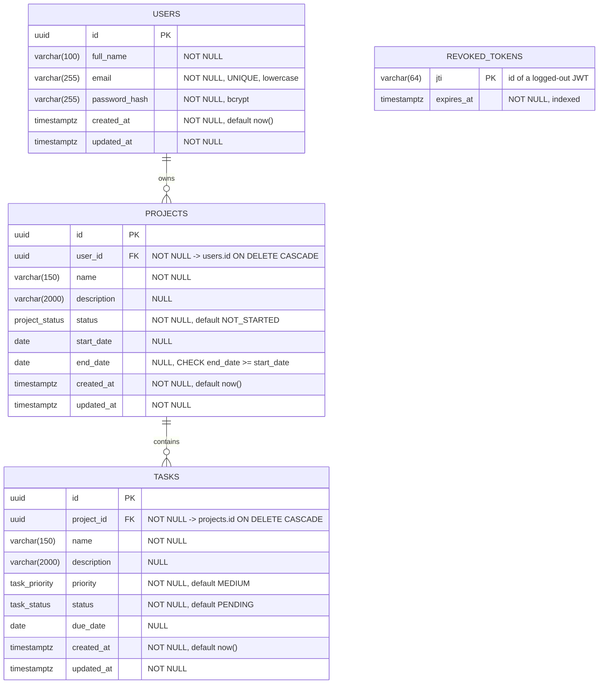

# Database Schema / ER Diagram

PostgreSQL, managed by Prisma migrations (`backend/prisma/`). Source of truth: `backend/prisma/schema.prisma`.

## Enums
| Type | Values |
|---|---|
| `project_status` | `NOT_STARTED`, `IN_PROGRESS`, `COMPLETED` |
| `task_status` | `PENDING`, `IN_PROGRESS`, `COMPLETED` |
| `task_priority` | `LOW`, `MEDIUM`, `HIGH` |

## Relationships & rules
- A user owns many projects; a project contains many tasks. Tasks reach their owner **through** the project (no duplicated `user_id`, 3NF).
- Deleting a project deletes its tasks; deleting a user deletes their projects and tasks (`ON DELETE CASCADE`).
- `revoked_tokens` is standalone: it stores logged-out token ids until they expire.

## Indexes
- `users.email` (unique)
- `projects (user_id, status)` — list/filter a user's projects, dashboard counts
- `tasks (project_id, status)` — list/filter a project's tasks, dashboard counts
- `revoked_tokens (expires_at)` — cleanup of expired entries

## Responsibilities
The database guarantees integrity (types, NOT NULL, UNIQUE, FK, CHECK, enums). Input format validation, authentication and **authorization (ownership)** are enforced by the backend — see `docs/API_CONTRACT.md` and `CLAUDE.md`.
